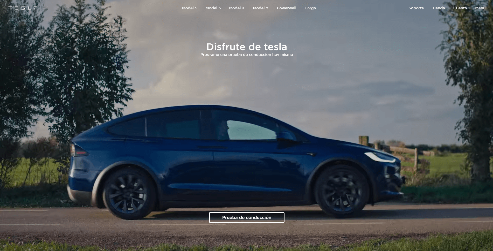

# Tesla - Landing page

Sitio web creado siguiendo el tutorial de [Midudev](https://midu.dev/), en el cual crea desde cero la pagina principal del sitio de Tesla. 

Fue realizado para practicar componentes de [Astro](https://astro.build/), como asi tambien para introducirme a [Tailwind](https://tailwindcss.com/), un framework de CSS basado en clases.

